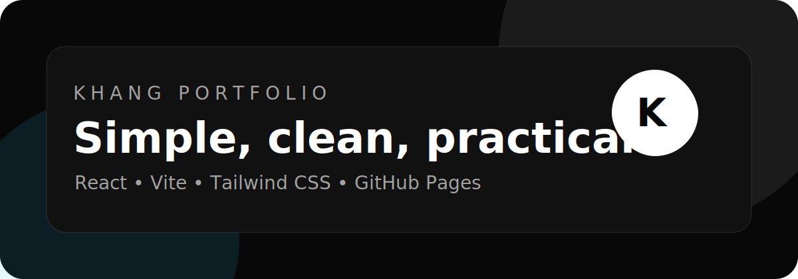

# Khang Portfolio



[](https://mm4you.github.io/khang-portfolio/)


Personal portfolio website for Khang, built to introduce my learning journey, projects, achievements and contact information.

## Live Website

https://mm4you.github.io/khang-portfolio/

## Highlights

- Responsive dark portfolio layout
- Vietnamese and English language toggle
- About, achievement, skills, projects and contact sections
- Realtime project deployment with GitHub Pages
- Clean React component structure with Tailwind CSS

## Featured Projects

- Smart Port Scheduling App: Top 20 DigiPort Logistics Hackathon 2025 idea
- Movie Ticket Booking System: software engineering and database project
- Realtime Chess & Caro Game: socket-based realtime game project

## Tech Stack

- React
- Vite
- Tailwind CSS
- Framer Motion
- Lucide React
- GitHub Pages

## Development

```bash
npm install
npm run dev
```

## Build

```bash
npm run build
```

## Contact

- GitHub: https://github.com/mm4you
- Email: ungnhutkhang53@gmail.com
- Facebook: https://www.facebook.com/agug103
- Instagram: https://www.instagram.com/kh4ng.u
